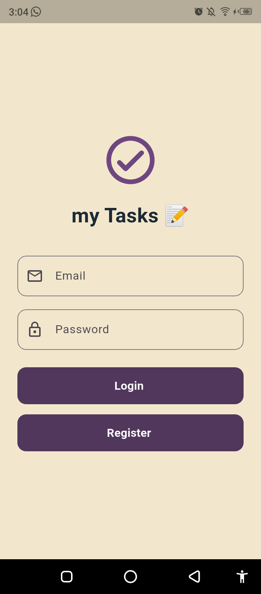
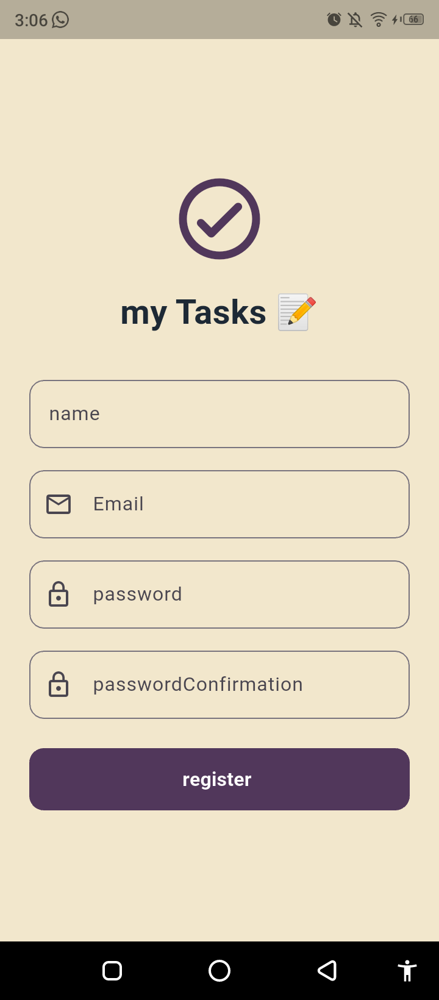
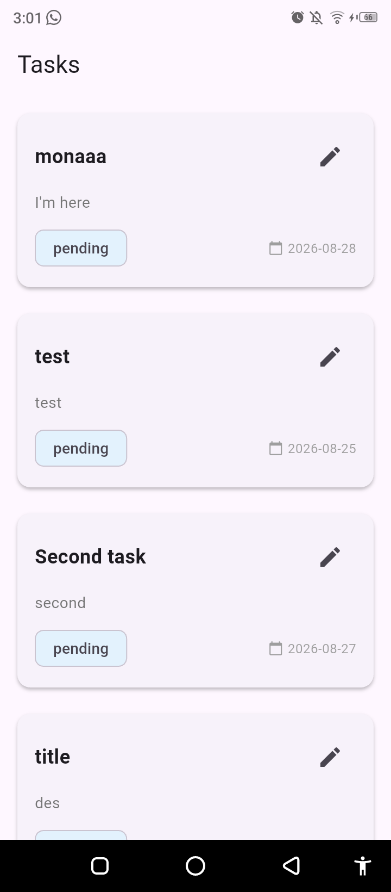
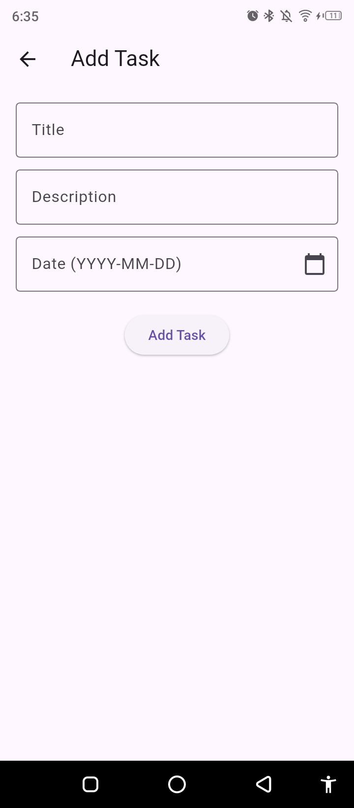
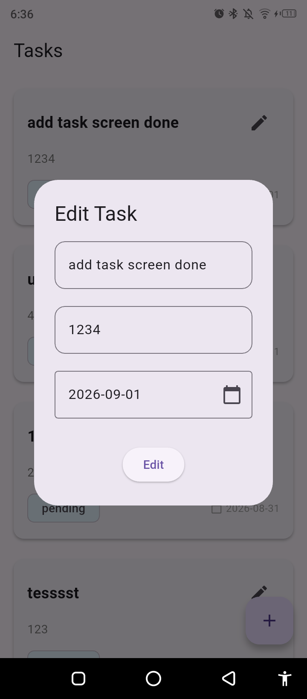
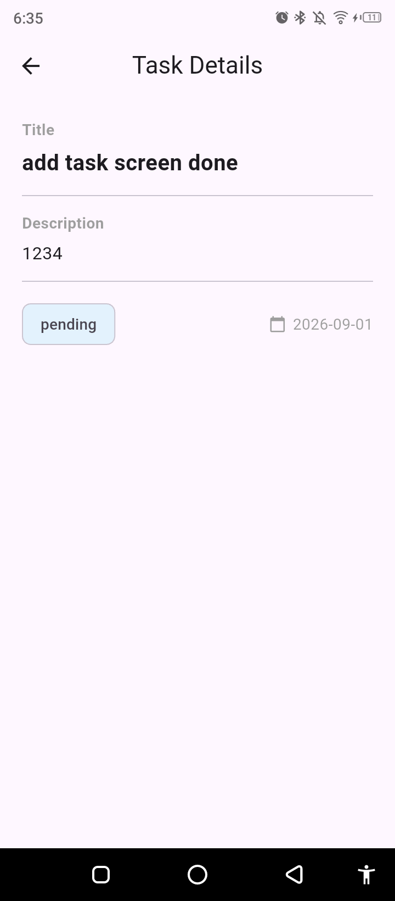

# 📝 My Tasks App

A sleek, intuitive Task Management application built to help users seamlessly create, track, and manage their daily activities.

---

## 📱 Screenshots

| Login Screen | Register Screen | Tasks List |
| :---: | :---: | :---: |
|  |  |  |
|  |  |  |

---

## 🛠️ Tech Stack & Tools

* **Framework**: Flutter
* **Language**: Dart
* **State Management**: Cubit / BLoC
* **Local Storage / Caching**: Hive / SharedPreferences
* **Networking**: Dio


## 📂 Project Structure

```text
lib/
├── core/
│   ├── helper/        # Utility and helper functions
│   ├── routes/        # App navigation and routing setup
│   ├── service/       # API, networking, and local services
│   └── widgets/       # Shared reusable UI widgets
├── features/
│   ├── auth/          # Authentication module (login, register)
│   │   ├── data/      # Data layer (models, repositories, data sources)
│   │   └── presentation/ # UI screens, cubits, and feature-specific widgets
│   │       ├── cubit/
│   │       ├── screens/
│   │       └── widgets/
│   └── home/          # Home / Tasks management module
├── root/              # App initialization & root configurations
└── main.dart          # Entry point of the application
```

---

## 🤝 Contributing

Contributions are welcome! Feel free to open issues or submit pull requests to improve the app.